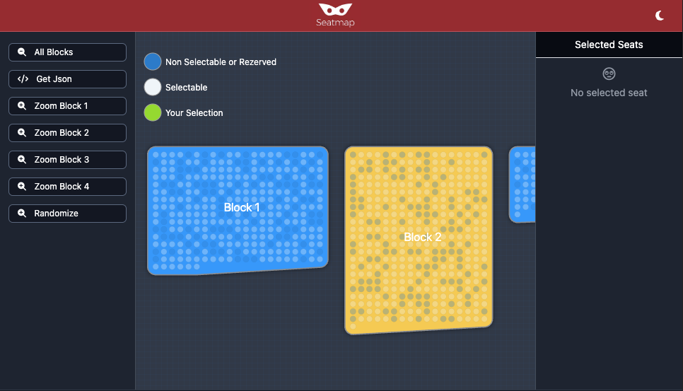

# Seatmap Canvas
Seatmap Canvas is an advanced, open-source library for interactive seat selection in various settings such as stadiums, theaters, and event spaces. Designed with d3.js, this code version is optimized for developers looking for a customizable and efficient solution to handle seat arrangements and user interactions.

[](https://alisaitteke.github.io/seatmap-canvas)

**[📖 Documentation](https://alisaitteke.github.io/seatmap-canvas/docs)** | **[🎯 Live Demo](https://alisaitteke.github.io/seatmap-canvas)**

## Features

- **Framework Agnostic** - Core library works with vanilla JS, plus official React and Vue 3 wrappers
- **Dynamic Seat Selection** - Interactive selection, categorization, and location of seats
- **Custom Background Images** - Global and per-block background images with positioning control
- **Customizable Styles** - Extensive styling options for seats, blocks, and labels
- **Interactive Seat Models** - Define properties like salability, notes, colors, and custom data
- **Block Organization** - Organize seats into blocks with titles, colors, and labels
- **Event System** - Simplified event listeners for seat interactions

## Screenshot
[](https://alisaitteke.github.io/seatmap-canvas)

## 🚀 Framework Plugins & Integrations

### 🌐 Web Frameworks

<p align="center">
  <a href="src/vue/README.md">
    
  </a>
  &nbsp;&nbsp;
  <a href="src/react/README.md">
    
  </a>
  &nbsp;&nbsp;
  
  &nbsp;&nbsp;
  
  &nbsp;&nbsp;
  
  &nbsp;&nbsp;
  
  &nbsp;&nbsp;
  
  &nbsp;&nbsp;
  
</p>

### 📱 Mobile Frameworks

<p align="center">
  
  &nbsp;&nbsp;
  
  &nbsp;&nbsp;
  
  &nbsp;&nbsp;
  
  &nbsp;&nbsp;
  
  &nbsp;&nbsp;
  
</p>

---

### 🌐 Web Framework Integrations

<div align="center">

| Framework | Status | Package | Documentation | Example |
|:----------|:------:|:--------|:-------------:|:-------:|
| **Vanilla JS** | ✅ Available | `@alisaitteke/seatmap-canvas` | [📖 Documentation](#vanilla-javascript) | [🎯 Example](examples/) |
| **Vue.js 3** | ⚠️ Testing | `@alisaitteke/seatmap-canvas/vue` | [📖 Documentation](src/vue/README.md) | [🎯 Example](examples/vue/) |
| **React** | ⚠️ Testing | `@alisaitteke/seatmap-canvas/react` | [📖 Documentation](src/react/README.md) | [🎯 Example](examples/react/) |
| **Next.js** | 🔜 Coming Soon | - | - | - |
| **Svelte** | 🔜 Coming Soon | - | - | - |
| **Angular** | 🔜 Coming Soon | - | - | - |
| **Nuxt** | 🔜 Coming Soon | - | - | - |
| **Solid.js** | 🔜 Coming Soon | - | - | - |
| **Astro** | 🔜 Coming Soon | - | - | - |

</div>

### 📱 Mobile Framework Integrations

<div align="center">

| Framework | Platform | Status | Package | Documentation | Example |
|:----------|:--------:|:------:|:--------|:-------------:|:-------:|
| **React Native** | iOS • Android | 🔜 Coming Soon | - | - | - |
| **Flutter** | iOS • Android | 🔜 Coming Soon | - | - | - |
| **Expo** | iOS • Android | 🔜 Coming Soon | - | - | - |
| **Ionic** | iOS • Android • Web | 🔜 Coming Soon | - | - | - |
| **Capacitor** | iOS • Android • Web | 🔜 Coming Soon | - | - | - |
| **.NET MAUI** | iOS • Android • Windows • macOS | 🔜 Coming Soon | - | - | - |

</div>

---

[LIVE DEMO](https://alisaitteke.github.io/seatmap-canvas/)


## What does it do?
#### In any organization
- Seat selection
- Seat categorizing
- Locating
- Turnstile and Gate information


## Installation

```bash
npm install @alisaitteke/seatmap-canvas
```

## Quick Start

---

<h3>
  
  &nbsp;Vue.js 3
</h3>

<table>
<tr>
<td width="50%">

**Installation**

```bash
npm install @alisaitteke/seatmap-canvas
```

**Setup** (`main.ts`)

```typescript
import { createApp } from 'vue';
import App from './App.vue';
import SeatmapCanvasPlugin from '@alisaitteke/seatmap-canvas/vue';
import '@alisaitteke/seatmap-canvas/dist/seatmap.canvas.css';

const app = createApp(App);
app.use(SeatmapCanvasPlugin);
app.mount('#app');
```

</td>
<td width="50%">

**Component Usage**

```vue
<template>
  <SeatmapCanvas
    :options="seatmapOptions"
    :data="blocks"
    @seat-click="onSeatClick"
  />
</template>

<script setup lang="ts">
const seatmapOptions = {
  legend: true,
  style: {
    seat: {
      hover: '#8fe100',
      selected: '#8fe100',
    }
  }
};

const onSeatClick = (seat) => {
  seat.isSelected() ? seat.unSelect() : seat.select();
};
</script>
```

</td>
</tr>
</table>

<p align="center">
  <a href="src/vue/README.md"></a>
  &nbsp;
  <a href="examples/vue/"></a>
</p>

---

<h3>
  
  &nbsp;React
</h3>

<table>
<tr>
<td width="50%">

**Installation**

```bash
npm install @alisaitteke/seatmap-canvas
```

</td>
<td width="50%">

**Component Usage**

```tsx
import { SeatmapCanvas } from '@alisaitteke/seatmap-canvas/react';
import '@alisaitteke/seatmap-canvas/dist/seatmap.canvas.css';

function App() {
  const handleSeatClick = (seat) => {
    seat.isSelected() ? seat.unSelect() : seat.select();
  };

  return (
    <SeatmapCanvas
      options={{
        legend: true,
        style: {
          seat: { hover: '#8fe100', selected: '#8fe100' }
        }
      }}
      data={blocks}
      onSeatClick={handleSeatClick}
    />
  );
}
```

</td>
</tr>
</table>

<p align="center">
  <a href="src/react/README.md"></a>
  &nbsp;
  <a href="examples/react/"></a>
</p>

---

<h3>
  
  &nbsp;Vanilla JavaScript
</h3>

<table>
<tr>
<td width="50%">

**Quick Setup**

```js
const config = {
  resizable: true,
  seat_style: {
    radius: 12,
    color: "#6796ff",
    hover: "#5671ff",
    selected: "#56aa45"
  }
};

const seatmap = new SeatmapCanvas(".container", config);
seatmap.setData(data);
```

</td>
<td width="50%">

**Event Handling**

```js
seatmap.addEventListener("seat_click", (seat) => {
  if (seat.selected) {
    seatmap.seatUnselect(seat);
  } else {
    seatmap.seatSelect(seat);
  }
});

// Get selected seats
const selected = seatmap.getSelectedSeats();
```

</td>
</tr>
</table>

<details>
<summary><strong>📋 Data Models Reference</strong></summary>

#### Seat Model
```json
{
  "id": 1,
  "title": "49",
  "x": 0,
  "y": 0,
  "salable": true,
  "note": "note test",
  "color":"#ffffff",
  "custom_data": {
    "any": "things"
  }
}
```

#### Block Model
```json
{
  "blocks": [{
    "id": 1,
    "title": "Test Block 1",
    "color": "#2c2828",
    "labels": [{ "title": "A", "x": -30, "y": 0 }],
    "seats": [
      { "id": 1, "x": 0, "y": 0, "salable": true, "title": "49" },
      { "id": 2, "x": 30, "y": 0, "salable": true, "title": "47" }
    ]
  }]
}
```

#### Configuration Options
```js
{
  click_enable_sold_seats: true,  // Enable clicking on unavailable seats (default: false)
  
  // Global Background Image
  background_image: "assets/stadium.jpg",      // Image URL (PNG, JPG, SVG, WebP, GIF)
  background_opacity: 0.3,                     // 0-1 (default: 0.3)
  background_fit: "cover",                     // "cover" | "contain" | "fill" | "none"
  background_x: 0,                            // Manual X position (optional, auto-detect if null)
  background_y: 0,                            // Manual Y position (optional)
  background_width: 1500,                     // Manual width (optional)
  background_height: 1000                     // Manual height (optional)
}
```

</details>

<details>
<summary><strong>🖼️ Custom Background Images</strong></summary>

#### Global Background

Add a background image to the entire stage:

```javascript
const seatmap = new SeatmapCanvas(".container", {
  background_image: "assets/concert-hall.jpg",
  background_opacity: 0.3,
  background_fit: "cover"
});
```

**With Manual Positioning:**
```javascript
const seatmap = new SeatmapCanvas(".container", {
  background_image: "assets/stadium.jpg",
  background_x: -500,        // Position X
  background_y: -500,        // Position Y
  background_width: 3000,    // Width
  background_height: 2500,   // Height
  background_opacity: 0.4,
  background_fit: "contain"  // Preserve aspect ratio
});
```

#### Block-Level Background

Add custom backgrounds to individual blocks:

```javascript
{
  blocks: [{
    id: "vip-section",
    title: "VIP Area",
    background_image: "assets/vip-lounge.jpg",
    background_opacity: 0.6,
    background_fit: "cover",
    seats: [...]
  }, {
    id: "general",
    title: "General Admission",
    background_image: "assets/general-area.jpg",
    background_opacity: 0.5,
    seats: [...]
  }]
}
```

**With Manual Positioning:**
```javascript
{
  blocks: [{
    id: "block-a",
    background_image: "section-a.jpg",
    background_x: 100,         // Exact X coordinate
    background_y: 200,         // Exact Y coordinate
    background_width: 500,     // Exact width
    background_height: 400,    // Exact height
    background_opacity: 0.7,
    background_fit: "cover",
    seats: [...]
  }]
}
```

#### Fit Modes

- **`cover`** (default) - Image covers entire area, may crop
- **`contain`** - Image fits inside area, preserves aspect ratio
- **`fill`** - Image stretches to fill area
- **`none`** - Image keeps original size, centered

#### Features

- ✅ **Auto-Detection:** X, Y, Width, Height auto-calculated from bounds if not specified
- ✅ **Clip-Path Masking:** Block backgrounds clipped to exact block shape
- ✅ **Opacity Control:** Adjustable transparency (0-1)
- ✅ **Auto-Hide Bounds:** Block borders/fills hidden when background exists
- ✅ **Zoom Preserved:** Bounds calculations still work for zoom levels
- ✅ **Format Support:** PNG, JPG, SVG, WebP, GIF, all web-compatible formats
- ✅ **Performance:** Browser-native image loading and caching

#### Use Cases

**Stadium/Arena:**
```javascript
// Stadium overview as background
background_image: "stadium-aerial.jpg"
```

**Theater:**
```javascript
// Stage photo per seating section
blocks: [
  { id: "orchestra", background_image: "orchestra-view.jpg" },
  { id: "balcony", background_image: "balcony-view.jpg" }
]
```

**Restaurant:**
```javascript
// Floor plan as background
background_image: "floor-plan.png",
background_opacity: 0.5,
background_fit: "contain"
```

**Event Space:**
```javascript
// Custom venue layout
background_image: "venue-layout.svg",
background_fit: "contain"
```

#### Important Notes

- Background images don't affect zoom calculations (bounds preserved)
- Block borders/fills automatically hidden when background assigned
- CORS: Images must be same-origin or CORS-enabled
- Performance: Use optimized images (< 500KB recommended)

</details>

<details>
<summary><strong>📝 Complete Example</strong></summary>
```javascript

var config = {
    "resizable": true,
    "seat_style": {
        "radius": 12,
        "color": "#6796ff",
        "hover": "#5671ff",
        "not_salable": "#424747",
        "selected": "#56aa45",
        "focus": "#435fa4",
        "focus_out": "#56aa45"
    },
    "block_style": {
        "fill": "#e2e2e2",
        "stroke": "#e2e2e2"
    },
    "label_style": {
        "color": "#000",
        "radius": 12,
        "font-size": "12px",
        "bg": "#ffffff"
    }
}

var seatmap = new SeatmapCanvas(".seats_container",config);
seatmap.addEventListener("seat_click", (seat) => {
    console.log(seat);
    if (seat.selected) {
        seatmap.seatUnselect(seat);
    } else {
        seatmap.seatSelect(seat);
    }
});
var data = {
    "blocks": [
        {
            "id": 1,
            "title": "Test Block 1",
            "color": "#2c2828",
            "labels": [
                {
                    "title": "A",
                    "x": -30,
                    "y": 0
                },
                {
                    "title": "B",
                    "x": 120,
                    "y": 30
                }
            ],
            "seats": [
                {
                    "id": 1,
                    "x": 0,
                    "y": 0,
                    "salable": true,
                    "note": "note test",
                    "title": "49"
                },
                {
                    "id": 2,
                    "x": 30,
                    "y": 0,
                    "salable": true,
                    "note": "note test",
                    "title": "47"
                }
            ]
        }
    ]
}

// SET SEATS DATA
seatmap.setData(data);
```

</details>

<p align="center">
  <a href="examples/"></a>
  &nbsp;
  <a href="examples/"></a>
</p>

---

## Links

- 📖 [Documentation](https://alisaitteke.github.io/seatmap-canvas/docs)
- 🎯 [Live Demo](https://alisaitteke.github.io/seatmap-canvas)
- 📦 [NPM Package](https://www.npmjs.com/package/@alisaitteke/seatmap-canvas)
- 🐛 [Report Issues](https://github.com/alisaitteke/seatmap-canvas/issues)

## Author

<div align="center">
  <a href="https://github.com/alisaitteke">
    
  </a>
  
  <h3>Ali Sait Teke</h3>
  
  <p>
    <a href="https://github.com/alisaitteke">
      
    </a>
    &nbsp;
    <a href="https://www.linkedin.com/in/alisaitteke">
      
    </a>
    &nbsp;
    <a href="https://twitter.com/alisaitteke">
      
    </a>
  </p>
</div>

## Contributors

Contributions are welcome! Feel free to submit issues and pull requests.
