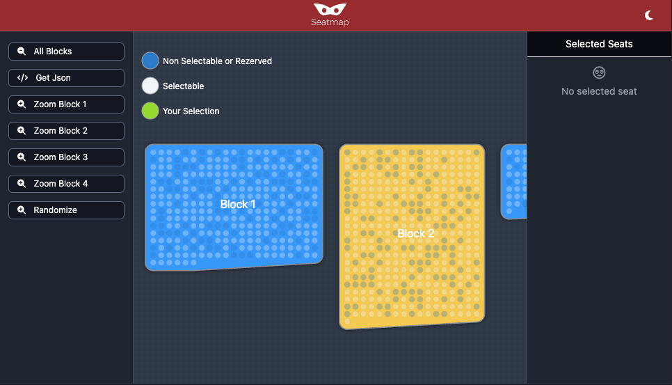

# Seatmap Canvas

**Seatmap Canvas** is an open-source, MIT-licensed JavaScript and TypeScript library for **interactive seat map** and **seating chart** selection in **stadiums**, **theaters**, cinemas, and event spaces. Install `@alisaitteke/seatmap-canvas` from npm, pass venue JSON via `replaceData()`, and embed in React, Vue, or vanilla JS apps — self-hosted with no per-seat SaaS fees.

Built with **D3.js** for smooth SVG rendering, three-level zoom (VENUE → BLOCK → SEAT), TypeScript definitions, and official framework wrappers for **seat selection** and **ticketing** flows.

[](https://seatmap.io/demo)

[](https://www.npmjs.com/package/@alisaitteke/seatmap-canvas) [](https://github.com/alisaitteke/seatmap-canvas/blob/master/LICENSE) **[📖 Documentation](https://seatmap.io)** | **[🎯 Live Demo](https://seatmap.io/demo)** | **[📦 NPM](https://www.npmjs.com/package/@alisaitteke/seatmap-canvas)**

## Features

### Highly Customizable

- **Custom Shapes** — Circles, rectangles, paths, and SVG files
- **Background Images** — Global and per-block backgrounds with positioning control (see [Custom Background Images](#-custom-background-images) below)
- **Styling Options** — Full control over seat, block, and label colors, sizes, and appearance
- **Custom Data** — Attach arbitrary metadata to seats via `custom_data`

### Developer Friendly

- **Framework Agnostic** — Vanilla JS plus official React, Vue 3, Next.js, and Angular wrappers
- **TypeScript** — Full type definitions included
- **Event System** — `SEAT.CLICK`, `BLOCK.CLICK`, and zoom-level change events
- **Pluggable Parsers** — Register custom formats with `addParser()` (Pretix built-in)

### Performance

- **Built with D3.js** — Smooth SVG rendering and interactions
- **Three-Level Zoom** — VENUE → BLOCK → SEAT with mouse and touch pan
- **Optimized** — Handles thousands of seats efficiently

### Easy to Use

- **Simple API** — `replaceData(blocks)` plus event listeners
- **Block Organization** — Titles, colors, and row/section labels
- **Flexible Install** — npm package or CDN

## Use Cases

| Use case | Description | Link |
| -------- | ----------- | ---- |
| Stadium seating | Section zoom, large venues | [Guide](https://seatmap.io/seo/use-cases/stadium-seating) |
| Theater booking | Row labels, sold/available states | [Guide](https://seatmap.io/seo/use-cases/theater-booking) |
| Ticketing platforms | Hold and checkout flows | [Guide](https://seatmap.io/seo/use-cases/ticketing-platforms) |
| Event spaces | Conferences, flexible layouts | [Example](https://seatmap.io/examples/event-space) |
| Restaurants | Table and seat management | [Examples](examples/) |
| Transportation | Bus, train, and plane seating | [Examples](examples/) |
| [All event types](#event-types--seatmap-features) | Industry mapping with feature jargon | Below |

## FAQ

<details>
<summary><strong>What is the best open-source seat map library for React?</strong></summary>

Seatmap Canvas (`@alisaitteke/seatmap-canvas`) is a strong open-source choice for React: MIT licensed, D3.js rendering, three-level zoom, and an official React wrapper at `@alisaitteke/seatmap-canvas/react`.

</details>

<details>
<summary><strong>Is Seatmap Canvas free?</strong></summary>

Yes. Seatmap Canvas is MIT licensed and free to use in commercial projects. You host the library yourself; there are no per-seat renderer fees from the open-source package.

</details>

<details>
<summary><strong>What is a seats.io alternative?</strong></summary>

Seatmap Canvas is an open-source, self-hosted seats.io alternative. You bring your own venue JSON and backend; seats.io provides a hosted chart designer and SaaS API.

</details>

<details>
<summary><strong>Can I use Seatmap Canvas for stadium ticketing?</strong></summary>

Yes. Seatmap Canvas handles large venues with block-level organization, venue/block/seat zoom, and seat click events suitable for ticketing hold and checkout flows.

</details>

<details>
<summary><strong>How do I embed a seat map on my website?</strong></summary>

Add a container div, install `@alisaitteke/seatmap-canvas`, pass venue JSON via `replaceData()`, and listen for seat click events to update your cart or booking API.

</details>

<details>
<summary><strong>How do I load seat data into Seatmap Canvas?</strong></summary>

Call `seatmap.data.replaceData(blocks)` with an array of blocks, each containing seats with `id`, `x`, `y`, and `salable` properties. There is no `setData()` method.

</details>

[Full FAQ →](https://seatmap.io/seo/faq)

## Why Seatmap Canvas?

- **MIT licensed and self-hosted** — no vendor lock-in or per-event renderer fees from the OSS package
- **Official npm packages** for React, Vue, Next.js, and Angular
- **Three-level zoom** built in (venue overview → block focus → seat view)
- **Bring your own venue JSON and backend** — full control over inventory and pricing
- **Open-source seats.io alternative** — embed in your ticketing stack without SaaS chart fees
- Read the full [seats.io alternative guide](https://seatmap.io/seo/alternatives/seats-io-alternative)

## Screenshot
[](https://seatmap.io/demo)

## 🚀 Framework Plugins & Integrations

### 🌐 Web Frameworks

<p align="center">
  <a href="src/vue/README.md">
    
  </a>
  &nbsp;&nbsp;
  <a href="src/react/README.md">
    
  </a>
  &nbsp;&nbsp;
  <a href="src/nextjs/README.md">
    
  </a>
  &nbsp;&nbsp;
  
  &nbsp;&nbsp;
  <a href="examples/angular/">
    
  </a>
  &nbsp;&nbsp;
  
  &nbsp;&nbsp;
  
  &nbsp;&nbsp;
  
</p>

### 📱 Mobile Frameworks

<p align="center">
  
  &nbsp;&nbsp;
  
  &nbsp;&nbsp;
  
  &nbsp;&nbsp;
  
  &nbsp;&nbsp;
  
  &nbsp;&nbsp;
  
</p>

---

### 🌐 Web Framework Integrations

<div align="center">

| Framework | Status | Package | Documentation | Example |
|:----------|:------:|:--------|:-------------:|:-------:|
| **Vanilla JS** | ✅ Available | `@alisaitteke/seatmap-canvas` | [📖 Documentation](#vanilla-javascript) | [🎯 Example](examples/) |
| **Vue.js 3** | ✅ Available | `@alisaitteke/seatmap-canvas/vue` | [📖 Documentation](src/vue/README.md) | [🎯 Example](examples/vue/) |
| **React** | ✅ Available | `@alisaitteke/seatmap-canvas/react` | [📖 Documentation](src/react/README.md) | [🎯 Example](examples/react/) |
| **Next.js** | ✅ Available | `@alisaitteke/seatmap-canvas/nextjs` | [📖 Documentation](src/nextjs/README.md) | [🎯 App Router](examples/nextjs-app/) • [Pages Router](examples/nextjs-pages/) |
| **Svelte** | 🔜 Coming Soon | - | - | - |
| **Angular** | ✅ Available | `@alisaitteke/seatmap-canvas/angular` | [📖 Documentation](https://seatmap.io/frameworks/angular) | [🎯 Example](examples/angular/) |
| **Nuxt** | 🔜 Coming Soon | - | - | - |
| **Solid.js** | 🔜 Coming Soon | - | - | - |
| **Astro** | 🔜 Coming Soon | - | - | - |

</div>

### 📱 Mobile Framework Integrations

<div align="center">

| Framework | Platform | Status | Package | Documentation | Example |
|:----------|:--------:|:------:|:--------|:-------------:|:-------:|
| **React Native** | iOS • Android | 🔜 Coming Soon | - | - | - |
| **Flutter** | iOS • Android | 🔜 Coming Soon | - | - | - |
| **Expo** | iOS • Android | 🔜 Coming Soon | - | - | - |
| **Ionic** | iOS • Android • Web | 🔜 Coming Soon | - | - | - |
| **Capacitor** | iOS • Android • Web | 🔜 Coming Soon | - | - | - |
| **.NET MAUI** | iOS • Android • Windows • macOS | 🔜 Coming Soon | - | - | - |

</div>

---

[LIVE DEMO](https://seatmap.io/demo)


## What does it do?
#### In any organization
- Seat selection
- Seat categorizing
- Locating
- Turnstile and Gate information


## Installation

```bash
npm install @alisaitteke/seatmap-canvas
```

## Quick Start

---

<h3>
  
  &nbsp;Vue.js 3
</h3>

<table>
<tr>
<td width="50%">

**Installation**

```bash
npm install @alisaitteke/seatmap-canvas
```

**Setup** (`main.ts`)

```typescript
import { createApp } from 'vue';
import App from './App.vue';
import SeatmapCanvasPlugin from '@alisaitteke/seatmap-canvas/vue';
import '@alisaitteke/seatmap-canvas/dist/seatmap.canvas.css';

const app = createApp(App);
app.use(SeatmapCanvasPlugin);
app.mount('#app');
```

</td>
<td width="50%">

**Component Usage**

```vue
<template>
  <SeatmapCanvas
    :options="seatmapOptions"
    :data="blocks"
    @seat-click="onSeatClick"
  />
</template>

<script setup lang="ts">
const seatmapOptions = {
  legend: true,
  style: {
    seat: {
      hover: '#8fe100',
      selected: '#8fe100',
    }
  }
};

const onSeatClick = (seat) => {
  seat.isSelected() ? seat.unSelect() : seat.select();
};
</script>
```

</td>
</tr>
</table>

<p align="center">
  <a href="https://seatmap.io/frameworks/vue"></a>
  &nbsp;
  <a href="examples/vue/"></a>
</p>

---

<h3>
  
  &nbsp;React
</h3>

<table>
<tr>
<td width="50%">

**Installation**

```bash
npm install @alisaitteke/seatmap-canvas
```

</td>
<td width="50%">

**Component Usage**

```tsx
import { SeatmapCanvas } from '@alisaitteke/seatmap-canvas/react';
import '@alisaitteke/seatmap-canvas/dist/seatmap.canvas.css';

function App() {
  const handleSeatClick = (seat) => {
    seat.isSelected() ? seat.unSelect() : seat.select();
  };

  return (
    <SeatmapCanvas
      options={{
        legend: true,
        style: {
          seat: { hover: '#8fe100', selected: '#8fe100' }
        }
      }}
      data={blocks}
      onSeatClick={handleSeatClick}
    />
  );
}
```

</td>
</tr>
</table>

<p align="center">
  <a href="https://seatmap.io/frameworks/react"></a>
  &nbsp;
  <a href="examples/react/"></a>
</p>

---

<h3>
  
  &nbsp;Next.js
</h3>

<table>
<tr>
<td width="50%">

**Installation**

```bash
npm install @alisaitteke/seatmap-canvas next react react-dom
```

**App Router (Client Component)**

```tsx
'use client';

import { SeatmapCanvas } from '@alisaitteke/seatmap-canvas/nextjs';
import '@alisaitteke/seatmap-canvas/dist/seatmap.canvas.css';

export default function VenuePage() {
  const handleSeatClick = (seat) => {
    seat.isSelected() ? seat.unSelect() : seat.select();
  };

  return (
    <SeatmapCanvas
      data={blocks}
      options={{ legend: true }}
      onSeatClick={handleSeatClick}
    />
  );
}
```

</td>
<td width="50%">

**Server Component + Data Fetching**

```tsx
import { SeatmapServerWrapper } from '@alisaitteke/seatmap-canvas/nextjs/app-router';
import '@alisaitteke/seatmap-canvas/dist/seatmap.canvas.css';

export default async function VenuePage({ params }) {
  return (
    <SeatmapServerWrapper
      dataSource={`/api/venues/${params.id}/seatmap`}
      options={{ legend: true }}
      revalidate={3600}
    />
  );
}
```

**Pages Router (Dynamic Import)**

```tsx
import { SeatmapCanvas } from '@alisaitteke/seatmap-canvas/nextjs/pages-router';

export default function VenuePage({ data }) {
  return <SeatmapCanvas data={data} />;
}
```

</td>
</tr>
</table>

<p align="center">
  <a href="https://seatmap.io/frameworks/nextjs"></a>
  &nbsp;
  <a href="examples/nextjs-app/"></a>
  &nbsp;
  <a href="examples/nextjs-pages/"></a>
</p>

---

<h3>
  
  &nbsp;Vanilla JavaScript
</h3>

<table>
<tr>
<td width="50%">

**Quick Setup**

```js
const config = {
  resizable: true,
  seat_style: {
    radius: 12,
    color: "#6796ff",
    hover: "#5671ff",
    selected: "#56aa45"
  }
};

const seatmap = new SeatmapCanvas(".container", config);
seatmap.setData(data);
```

</td>
<td width="50%">

**Event Handling**

```js
seatmap.addEventListener("seat_click", (seat) => {
  if (seat.selected) {
    seatmap.seatUnselect(seat);
  } else {
    seatmap.seatSelect(seat);
  }
});

// Get selected seats
const selected = seatmap.getSelectedSeats();
```

</td>
</tr>
</table>

<details>
<summary><strong>📋 Data Models Reference</strong></summary>

#### Seat Model
```json
{
  "id": 1,
  "title": "49",
  "x": 0,
  "y": 0,
  "salable": true,
  "note": "note test",
  "color":"#ffffff",
  "custom_data": {
    "any": "things"
  }
}
```

#### Block Model
```json
{
  "blocks": [{
    "id": 1,
    "title": "Test Block 1",
    "color": "#2c2828",
    "labels": [{ "title": "A", "x": -30, "y": 0 }],
    "seats": [
      { "id": 1, "x": 0, "y": 0, "salable": true, "title": "49" },
      { "id": 2, "x": 30, "y": 0, "salable": true, "title": "47" }
    ]
  }]
}
```

#### Configuration Options
```js
{
  click_enable_sold_seats: true,  // Enable clicking on unavailable seats (default: false)
  
  // Global Background Image
  background_image: "assets/stadium.jpg",      // Image URL (PNG, JPG, SVG, WebP, GIF)
  background_opacity: 0.3,                     // 0-1 (default: 0.3)
  background_fit: "cover",                     // "cover" | "contain" | "fill" | "none"
  background_x: 0,                            // Manual X position (optional, auto-detect if null)
  background_y: 0,                            // Manual Y position (optional)
  background_width: 1500,                     // Manual width (optional)
  background_height: 1000                     // Manual height (optional)
}
```

</details>

<details>
<summary><strong>🖼️ Custom Background Images</strong></summary>

#### Global Background

Add a background image to the entire stage:

```javascript
const seatmap = new SeatmapCanvas(".container", {
  background_image: "assets/concert-hall.jpg",
  background_opacity: 0.3,
  background_fit: "cover"
});
```

**With Manual Positioning:**
```javascript
const seatmap = new SeatmapCanvas(".container", {
  background_image: "assets/stadium.jpg",
  background_x: -500,        // Position X
  background_y: -500,        // Position Y
  background_width: 3000,    // Width
  background_height: 2500,   // Height
  background_opacity: 0.4,
  background_fit: "contain"  // Preserve aspect ratio
});
```

#### Block-Level Background

Add custom backgrounds to individual blocks:

```javascript
{
  blocks: [{
    id: "vip-section",
    title: "VIP Area",
    background_image: "assets/vip-lounge.jpg",
    background_opacity: 0.6,
    background_fit: "cover",
    seats: [...]
  }, {
    id: "general",
    title: "General Admission",
    background_image: "assets/general-area.jpg",
    background_opacity: 0.5,
    seats: [...]
  }]
}
```

**With Manual Positioning:**
```javascript
{
  blocks: [{
    id: "block-a",
    background_image: "section-a.jpg",
    background_x: 100,         // Exact X coordinate
    background_y: 200,         // Exact Y coordinate
    background_width: 500,     // Exact width
    background_height: 400,    // Exact height
    background_opacity: 0.7,
    background_fit: "cover",
    seats: [...]
  }]
}
```

#### Fit Modes

- **`cover`** (default) - Image covers entire area, may crop
- **`contain`** - Image fits inside area, preserves aspect ratio
- **`fill`** - Image stretches to fill area
- **`none`** - Image keeps original size, centered

#### Features

- ✅ **Auto-Detection:** X, Y, Width, Height auto-calculated from bounds if not specified
- ✅ **Clip-Path Masking:** Block backgrounds clipped to exact block shape
- ✅ **Opacity Control:** Adjustable transparency (0-1)
- ✅ **Auto-Hide Bounds:** Block borders/fills hidden when background exists
- ✅ **Zoom Preserved:** Bounds calculations still work for zoom levels
- ✅ **Format Support:** PNG, JPG, SVG, WebP, GIF, all web-compatible formats
- ✅ **Performance:** Browser-native image loading and caching

#### Use Cases

**Stadium/Arena:**
```javascript
// Stadium overview as background
background_image: "stadium-aerial.jpg"
```

**Theater:**
```javascript
// Stage photo per seating section
blocks: [
  { id: "orchestra", background_image: "orchestra-view.jpg" },
  { id: "balcony", background_image: "balcony-view.jpg" }
]
```

**Restaurant:**
```javascript
// Floor plan as background
background_image: "floor-plan.png",
background_opacity: 0.5,
background_fit: "contain"
```

**Event Space:**
```javascript
// Custom venue layout
background_image: "venue-layout.svg",
background_fit: "contain"
```

#### Important Notes

- Background images don't affect zoom calculations (bounds preserved)
- Block borders/fills automatically hidden when background assigned
- CORS: Images must be same-origin or CORS-enabled
- Performance: Use optimized images (< 500KB recommended)

</details>

<p align="center">
  <a href="https://seatmap.io/frameworks/vanilla-js"></a>
  &nbsp;
  <a href="examples/"></a>
</p>

---

## Event Types & Seatmap Features

Seatmap Canvas is a **renderer and selection widget** — not a full ticketing stack. Inventory, holds, and checkout live in your backend; the map drives visual selection via `SEAT.CLICK`, `OBJECT.CLICK`, and `replaceData()` updates to `salable` / `selected`.

Every event type below maps to at least one library capability. Jargon terms are shown in parentheses.

### Feature legend

| Shorthand | Jargon | What it maps to in Seatmap Canvas |
| --------- | ------ | --------------------------------- |
| **S+Z** | *reserved seating + zoom* | `blocks` / `seats` with VENUE → BLOCK → SEAT zoom |
| **Sec** | *section polygon / drill-down* | Chart-level `section` object; `SECTION.ENTER` / `SECTION.EXIT` |
| **Lbl** | *row / block labels* | `labels[]` on blocks (row names, “Stage”, etc.) |
| **Tbl** | *table seating* | `table` objects (`round` / `rect`) + chair seats |
| **GA** | *general admission (GA) area* | Chart-level `ga` object; capacity zone, selectable as a whole |
| **Bth** | *booth / box* | Chart-level `booth`; suite, stand, or VIP pod |
| **Ico** | *venue icons / POI* | `icon` objects: stage, entrance, exit, restrooms, bar, food |
| **FP** | *focal point* | `focal_point` — orientation anchor (stage, pitch, screen) |
| **MF** | *multi-floor* | `floors[]` (up to 9) + floor picker / stacked view |
| **BG** | *floor-plan background* | `background_image` (global, per-block, or per-floor) |
| **CD** | *seat metadata / pricing tiers* | `custom_data`, `color`, `salable` for categories and holds |
| **Shp** | *decorative shapes* | `shape` objects (zones, paths, foreground/background layers) |
| **Txt** | *free text labels* | `text` objects for captions and wayfinding |

### Sports

| Event | Seatmap feature |
| ----- | --------------- |
| Football (soccer) | **Sec** (*section polygon*) + **S+Z** (*reserved seating + zoom*) + **FP** (*focal point*) + **Ico** (*venue icons*) |
| Basketball / hockey / volleyball | **Sec** + **S+Z** + **FP** — arena bowl layers |
| American football / baseball | **Sec** + **S+Z** + **MF** (*multi-floor*) |
| Tennis / golf | **S+Z** + **GA** (*general admission*) + **BG** (*floor-plan background*) |
| Boxing / MMA / wrestling | **S+Z** + **FP** + **Bth** (*booth / box*) |
| Motorsport (F1, MotoGP, etc.) | **Sec** + **GA** + **S+Z** |
| Horse racing | **Sec** + **Bth** + **Ico** |
| Esports | **S+Z** + **FP** + **Ico** (*stage*) |
| School / amateur sports | **S+Z** + **Sec** |

### Performing arts & culture

| Event | Seatmap feature |
| ----- | --------------- |
| Theatre | **S+Z** + **Lbl** (*row labels*) + **MF** + **BG** |
| Opera / ballet | **S+Z** + **CD** (*pricing tiers*) + **MF** |
| Concert (indoor hall) | **S+Z** + **FP** + **CD** |
| Stand-up comedy | **S+Z** + **Tbl** (*table seating*) |
| Musical (Broadway-style) | **S+Z** + **Sec** + **MF** |
| Dance performance | **S+Z** + **FP** + **Ico** (*stage*) |
| Circus | **S+Z** + **GA** |
| Orchestra / classical | **S+Z** + **Lbl** + **CD** |
| Cinema (premium) | **S+Z** + **Lbl** |
| Outdoor cinema | **GA** + **Tbl** |
| Film festival | **S+Z** + **Sec** |

### Festivals & outdoor

| Event | Seatmap feature |
| ----- | --------------- |
| Music festival | **GA** + **Sec** / **Bth** (VIP) + **Ico** (*stage / bar*) |
| Food festival | **GA** + **Bth** (*vendor booth*) |
| Arts / culture festival | **GA** + **Ico** (*stage*) + **Shp** (*zone shapes*) |
| Fair / trade fair (outdoor) | **Bth** + **GA** + **Ico** |
| Carnival / street festival | **GA** + **Shp** |

### Corporate & professional

| Event | Seatmap feature |
| ----- | --------------- |
| Conference / summit | **S+Z** + **Lbl** + **FP** |
| Convention / congress | **Sec** + **MF** + **Ico** |
| Trade show / expo | **Bth** (*exhibitor stand*) + **GA** + **Ico** |
| Seminar / workshop | **S+Z** + **Tbl** |
| Product launch | **S+Z** + **CD** |
| Networking event | **Tbl** (*round tables*) + **GA** |
| Training / certification | **S+Z** + **Lbl** |
| Corporate AGM | **S+Z** + **CD** |
| Gala / awards ceremony | **Tbl** + **S+Z** + **Ico** (*stage*) |
| Corporate dinner / banquet | **Tbl** + **S+Z** |

### Social & private events

| Event | Seatmap feature |
| ----- | --------------- |
| Wedding reception | **Tbl** (*round / rect*) + **S+Z** + **BG** |
| Engagement / henna night | **Tbl** + **Shp** + **Ico** |
| Birthday party | **Tbl** + **GA** |
| Graduation ball (prom) | **Tbl** + **S+Z** |
| Charity gala | **Tbl** + **Bth** (*sponsor booth / VIP box*) |
| University graduation ceremony | **S+Z** + **Sec** + **MF** |
| School convocation | **S+Z** + **Lbl** + **Sec** |

### Nightlife & entertainment

| Event | Seatmap feature |
| ----- | --------------- |
| Nightclub / DJ set | **GA** + **Tbl** / **Bth** |
| Private party (club night) | **Tbl** + **Ico** (*bar*) + **GA** |
| Cabaret / dinner show | **Tbl** + **FP** + **Ico** (*stage*) |
| Bar event | **GA** + **Tbl** |

### Tourism, experiences & other

| Event | Seatmap feature |
| ----- | --------------- |
| Museum / exhibition | **GA** + **MF** + **Ico** |
| Theme park | **GA** + **Sec** + **S+Z** |
| Guided tour | **GA** + **Ico** + **Txt** (*text labels*) |
| Cruise / ship event | **Tbl** + **MF** + **S+Z** |
| Zoo / aquarium | **GA** + **Sec** + **Ico** |
| Large religious gathering (hall) | **S+Z** + **Sec** + **MF** |
| Political rally / demonstration | **GA** + **Sec** + **FP** |
| Marathon (spectator side) | **GA** + **Ico** |
| Camp / retreat | **Tbl** + **GA** + **Shp** |
| Online webinar (hybrid visual) | **Sec** + **GA** |
| Book signing | **GA** + **S+Z** |
| Live podcast (studio audience) | **S+Z** + **Tbl** |
| Transportation (bus / train / plane) | **S+Z** + **Lbl** |

### Minimum viable feature by scenario

| Scenario | Lowest-fit Seatmap layer |
| -------- | ------------------------ |
| Standing / crowd-heavy | **GA** (*general admission area*) — capacity polygon, `OBJECT.CLICK` |
| Stall / sponsor / VIP pod | **Bth** (*booth / box*) — single selectable unit |
| Seated audience | **S+Z** (*reserved seating + zoom*) — `blocks` + `seats` |
| Large venue | **Sec** (*section drill-down*) + zoom |
| Seated dinner / wedding | **Tbl** (*table seating*) + seats |
| Wayfinding | **Ico** + **Txt** + **FP** |
| Multi-level building / ship | **MF** (*multi-floor*) |
| Overlay on real plan | **BG** + **Shp** |

---

## Links

- 📖 [Full Documentation](https://seatmap.io)
- 🎯 [Live Demo](https://seatmap.io/demo)
- 📦 [NPM Package](https://www.npmjs.com/package/@alisaitteke/seatmap-canvas)
- 🐛 [Report Issues](https://github.com/alisaitteke/seatmap-canvas/issues)
- ❓ [FAQ](https://seatmap.io/seo/faq)
- 🏟️ [Stadium seating guide](https://seatmap.io/seo/use-cases/stadium-seating)
- 🔄 [seats.io alternative](https://seatmap.io/seo/alternatives/seats-io-alternative)
- 📍 [What is an interactive seat map?](https://seatmap.io/seo/what-is-interactive-seat-map)

## License

Seatmap Canvas is [MIT licensed](https://github.com/alisaitteke/seatmap-canvas/blob/master/LICENSE).

## Author

<div align="center">
  <a href="https://github.com/alisaitteke">
    
  </a>
  
  <h3>Ali Sait Teke</h3>
  
  <p>
    <a href="https://github.com/alisaitteke">
      
    </a>
    &nbsp;
    <a href="https://www.linkedin.com/in/alisaitteke">
      
    </a>
    &nbsp;
    <a href="https://twitter.com/alisaitteke">
      
    </a>
  </p>
</div>

## Contributors

Contributions are welcome! Feel free to submit issues and pull requests.
